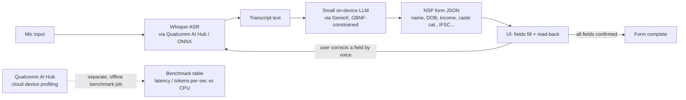

# Build Plan — VoiceForm

Deadline: 30 Sep 2026, 11:59 PM IST (single submission, no edits after). Today: 17 Sep 2026 — ~13 days remain. Time budget: 15-40 hours, solo, beginner skill, "vibe codes" (AI-assisted).

## Stack (versions/tools from [[toolkit]])
- **ASR**: Whisper-tiny or Distil-Whisper, exported via `qualcomm/ai-hub-apps` Whisper Speech-to-Text sample app (Python, ONNX), profiled on Qualcomm AI Hub's cloud-hosted Snapdragon X device
- **Slot-filling LLM**: Llama-3.2-1B/3B or Phi-3.5-mini (GGUF), run via `qualcomm/GenieX` local OpenAI-compatible server
- **Structured output**: GBNF grammar (llama.cpp's `json-schema-to-grammar.py`) constraining the LLM to the NSP form's JSON schema
- **Frontend**: simplest thing that works — a local Python web app (Streamlit or plain Flask + HTML/JS) is enough; no framework needed given the flat/static design decision
- **Fonts**: Noto Sans Devanagari + Inter (Google Fonts, bundled locally for offline demo)
- **Review tools**: `pbakaus/impeccable` (UI slop audit), `DietrichGebert/ponytail` (lean-code review)

## Architecture sketch

Note: the profiling path (H→I) is deliberately separate from the live demo path (A→G) — the app demos on the participant's own machine; the NPU benchmark numbers come from a genuine cloud-hosted device job. Keep this distinction explicit everywhere (README, video, code comments) per [[verdict]] Decision #13.

## Data sources
- Real NSP Post-Matric Scholarship form field list (pull from the live portal or its public PDF instructions) — locks the JSON schema. **This is today's second task, after the AI Hub benchmark.**
- Sample Hindi speech for testing: record your own voice reading realistic field values (name, income figures, IFSC codes) — no dataset needed for a single-user demo.

## Milestones (day-by-day, ~13 days, 15-40hr budget)

| Day | Milestone | Hours |
|---|---|---|
| Day 1 (today) | (1) Create Qualcomm AI Hub account, run the unmodified Whisper sample app, get one real cloud-device profiling benchmark number. (2) Pull the live NSP form field list, lock the JSON schema. | 2-3 |
| Day 2-3 | Get Whisper ASR running locally end-to-end on your own machine (own voice → transcript). This is the riskiest integration (export/quantization dependency issues) — if it doesn't work by end of Day 3, fall back to pick #2 in [[toolkit]] (`simple-whisper-transcription`). | 4-6 |
| Day 4-5 | Stand up GenieX with a small GGUF model; write the GBNF grammar for the locked JSON schema; prompt-test transcript → JSON slot-filling on a few sample sentences. | 4-6 |
| Day 6-7 | Wire ASR → LLM → JSON → simple UI (fields fill on screen). Vertical slice: ugly but end-to-end, per build-playbook rule "get the wow moment working early." | 4-6 |
| Day 8-9 | Build the confirm-and-correct loop: read back a field, accept a spoken "no, change it" correction, re-fill just that field. This is the signature feature — don't skip or rush it. | 4-6 |
| Day 10 | Freeze features. Run `impeccable audit`/`polish` and `ponytail-review` passes. Fix anything a skeptical reviewer would flag. | 2-3 |
| Day 11 | Record the backup/fallback demo video (per Session A's fallback-plan requirement) — a clean, working take saved before any last-minute risk. | 2 |
| Day 12 | Write the README (problem, real vs. simulated, install steps, benchmark table, architecture diagram, demo video link). Re-run the AI Hub profiling job if anything changed, to keep numbers accurate. | 3-4 |
| Day 13 (buffer before 30 Sep deadline) | Final test of install-from-scratch on a clean environment (or ask someone else to try it). Submit. No edits allowed after — double-check every field before hitting submit. | 2 |

Total: ~27-38 hours, fits the 15-40hr budget with slack for the ASR integration risk (the single most likely place to lose time).

## Who owns what
Solo — no delegation. If time runs critically short, the cut line in [[verdict]] Decision #12 defines what to drop, in order: (1) any "SDK" framing — never build it, mention once in README; (2) multi-language — Hindi only, already scoped; (3) TTS voice replies — fall back to on-screen text/visual confirmation only; (4) UI animation — keep the single mic-pulse, drop anything beyond it.

## The cut line (repeated from verdict for build-time reference)
Never cut: the Qualcomm AI Hub benchmark table, the confirm-and-correct loop. Everything else is negotiable under time pressure.

## Risk list with fallbacks
| Risk | Fallback |
|---|---|
| Whisper export/quantization via AI Hub breaks (dependency mismatches — flagged by Session A's Executor as the most likely failure point) | Switch to `simple-whisper-transcription` (toolkit pick #2); if still blocked by Day 3, use Whisper's own CPU inference locally for the app demo and rely solely on the AI Hub cloud profiling job (run against the official unmodified sample app) for the NPU benchmark number — keep this distinction explicit in the README |
| GenieX/GGUF LLM doesn't reliably produce valid JSON even with GBNF | Add a Python-side JSON validation + single retry-with-error-message-in-prompt loop as a safety net; if that still fails, narrow the schema to fewer fields (name, income, IFSC only) rather than abandoning structured output entirely |
| No physical Snapdragon hardware means live demo can't literally show NPU inference on stage | Explicitly separate "live app demo" (own machine) from "NPU benchmark proof" (AI Hub cloud profiling job) everywhere in README/video — this is a stated council decision, not a hidden gap |
| Single-submission, no-edit rule + fragile solo toolchain | Recorded backup demo video finished by Day 11, well before the deadline — never rely on a live/last-minute run |
| Hindi ASR/LLM output contains real mistakes on demo day | Build the confirm-and-correct loop specifically so a live mistake becomes a feature demonstration, not a failure — script the demo to include one intentional correction |
| Running out of time before Day 13 | Cut line above, in order; the two "never cut" items are scoped to be buildable within the first 9 days, leaving days 10-13 as pure hardening/packaging buffer |

## Submission checklist
- [ ] Real Qualcomm AI Hub cloud-device profiling benchmark obtained and recorded (device name, latency, tokens-per-sec, CPU comparison)
- [ ] NSP form JSON schema locked against the live/public form
- [ ] Voice-to-form flow works end-to-end on a clean run
- [ ] Confirm-and-correct loop demonstrated with at least one real correction
- [ ] `impeccable` audit and `ponytail-review` passes completed
- [ ] Backup demo video recorded and reviewed
- [ ] README states clearly what's real vs. simulated/cloud-profiled (per Decision #13)
- [ ] README includes: problem, demo video, architecture diagram, install steps, benchmark table, what's real vs. mocked
- [ ] One submission only, fields double-checked — no edits possible after submit
- [ ] Submitted before 30 Sep 2026, 11:59 PM IST
